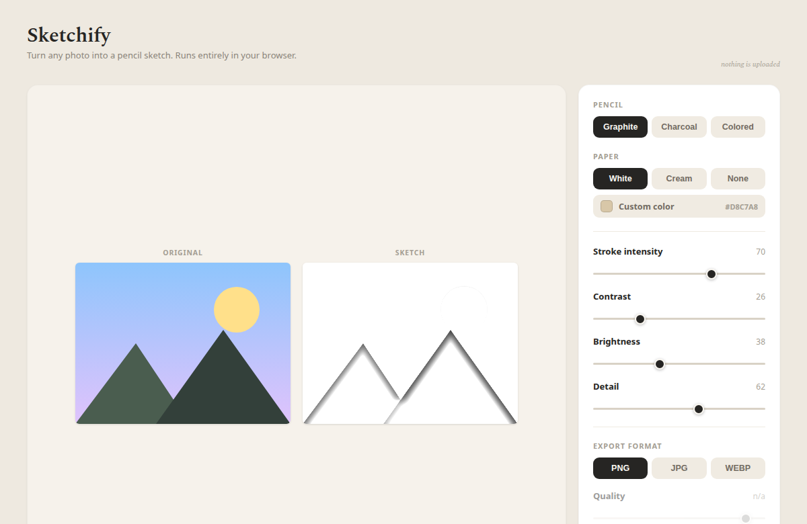

# Sketchify

Turn any photo into a pencil sketch, entirely in your browser. Nothing is uploaded — the
image never leaves your device.



## Features

- **Drag, drop, or browse** to load a JPG, PNG, or WEBP.
- **Live preview** of the original and the sketch, side by side.
- **Pencil types:** graphite, charcoal, and colored.
- **Paper backgrounds:** white, cream, transparent, or a custom colour.
- **Fine-tuning:** stroke intensity, contrast, brightness, and detail.
- **Export** as PNG, JPG, or WEBP with an adjustable quality.
- **Fully client-side** — processing runs in a Web Worker, so the UI stays responsive and
  no data is sent anywhere.

## How it works

The sketch uses the classic "color dodge" pencil technique (`src/sketch/sketch.ts`):

1. Convert the photo to grayscale and keep its inverse.
2. Blur the inverse twice with a fast separable box blur (radius set by **Detail**).
3. Color-dodge blend the grayscale over the blurred inverse to find edges.
4. Apply **Contrast**/**Brightness**, then a gamma curve (**Stroke intensity**) to get the
   per-pixel line amount.
5. Composite the pencil ink over the chosen paper (or export alpha for a transparent
   background).

The algorithm is a pure, DOM-free function that runs both in the Web Worker and in unit
tests.

## Tech stack

- [Vite](https://vite.dev/) + [React](https://react.dev/) + TypeScript
- CSS Modules with a small design-tokens file (`src/styles/tokens.css`)
- Web Worker for image processing
- [Vitest](https://vitest.dev/) for unit tests
- ESLint + Prettier

## Project structure

```
src/
  App.tsx                 App shell + top-level state
  sketch/                 The pure sketch algorithm and its Web Worker
    sketch.ts             toSketch(imageData, params) -> imageData
    boxBlur.ts            separable box blur
    sketch.worker.ts      runs toSketch off the main thread
    types.ts              SketchParams and friends
  hooks/useSketch.ts      debounced worker orchestration
  lib/                    image loading, colour parsing, download
  state/sketchParams.ts   params reducer
  components/             Stage, Controls, SegmentedControl, Slider, ImageCanvas
  styles/                 tokens + global styles
```

## Development

```bash
npm install      # install dependencies
npm run dev      # start the dev server
npm test         # run unit tests
npm run lint     # lint
npm run typecheck
npm run build    # production build into dist/
npm run preview  # preview the production build
```

## Deployment

`npm run build` produces a static site in `dist/` that can be served from any static host.
The Vite `base` is relative (`./`), so it works from a sub-path too.

A GitHub Actions workflow (`.github/workflows/deploy.yml`) publishes to GitHub Pages. To
enable it, go to **Settings → Pages → Build and deployment** and set the source to
**GitHub Actions**.
